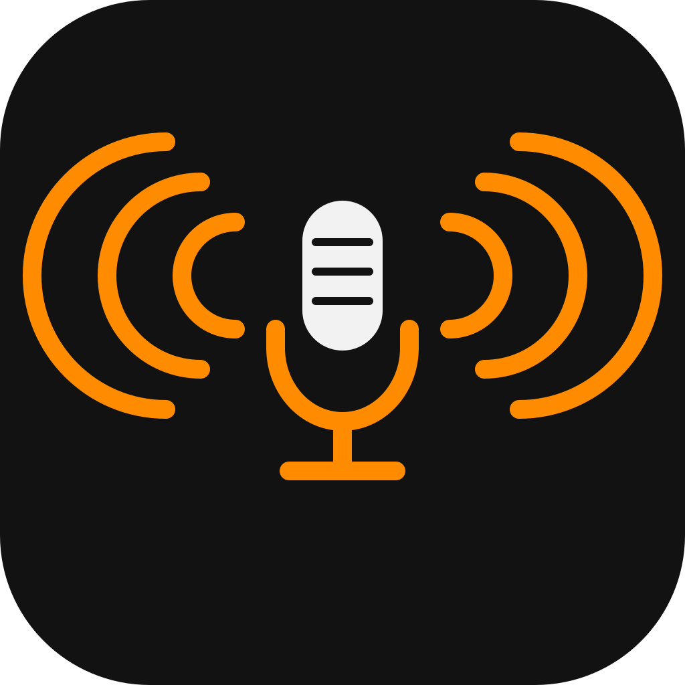

# Soundboard

<br clear="left">

Open-source, cross-platform (Windows, macOS, Linux) soundboard. Continuously
mixes your microphone with triggered sound clips and sends the combined
audio to a chosen output device — typically a virtual audio cable — so
your voice and your sounds reach Discord, games, or any other voice app
together, from one virtual microphone.

## Features

- Assign any audio file (wav, flac, ogg, mp3) to a button
- Play sounds on click or via a global hotkey, even while unfocused
- Enable/disable each sound's hotkey independently with a checkbox,
  without removing it from the board
- Mixes your real microphone with soundboard clips in real time, so
  people hear both at once — no separate mixer app needed
- Choose which microphone (input) and which virtual cable (output) are used
- "Hear soundboard" toggle plays clips on your own speakers/headphones
  too — turning it off doesn't affect what others hear through the
  virtual cable
- Re-triggering a sound that's still playing restarts it
- **Download** tab: grab audio from YouTube, TikTok, Instagram and other
  sites (via yt-dlp) as MP3, straight into your board
- **Sound Editor** tab: trim a clip's start/end and boost or cut bass,
  with a waveform view and preview
- All sounds live in one `Sounds/` folder
- Settings persist automatically between runs
- Runs from source (Python) or as a standalone executable — no Python
  required on the machine you run it on
- 100% free and open-source, no paywalled dependencies or services

## Download

Grab a pre-built executable from the [Releases](../../releases) page —
no Python or setup required, just download and run. Windows, macOS, and
Linux builds are published automatically for each tagged version (see
[Building a standalone executable](#building-a-standalone-executable)).

## Running from source

Requirements: Python 3.9+ with a current Tk. On macOS, the Python that
ships with Apple's Command Line Tools has an outdated Tk that shows a
blank window; use Homebrew instead (`brew install python@3.12 python-tk@3.12`).

1. Set up a virtual audio device for your OS (see below).
2. Install dependencies:

   ```
   pip install -r requirements.txt
   ```

3. Run:

   ```
   python soundboard.py
   ```

### Virtual audio device by platform

The app mixes your microphone and your sound clips itself, so you only
need a virtual cable to carry that combined audio into Discord/games —
no separate OS-level mixer or loopback routing is required.

**Windows** — install [VB-CABLE](https://vb-audio.com/Cable/) (free) or the
open-source [VirtualAudioCable by frgnca](https://github.com/frgnca/VirtualAudioCable).

**macOS** — install [BlackHole](https://github.com/ExistentialAudio/BlackHole)
(free, open-source).

**Linux** — no install needed; PulseAudio/PipeWire can create a null sink:

```
pactl load-module module-null-sink sink_name=soundboard sink_properties=device.description=Soundboard
```

(use `pavucontrol` for a GUI alternative to the CLI command above.)

In all three cases: pick your real microphone as the **input** device and
the virtual cable as the **output** device in Soundboard, then select the
virtual cable as your microphone in Discord/games.

## Usage

- **Microphone (input):** your real microphone — this is what gets mixed
  with sound clips and sent onward.
- **Virtual mic output:** the virtual cable that Discord/games should use
  as their microphone input. Pick `(none)` to disable a side if you don't
  need it (e.g. no mic passthrough).
- **Hear soundboard:** when checked, clips also play on your system's
  default output (your speakers/headphones) so you know what's being
  triggered. Only clips are sent there, not your mic. If the virtual mic
  output is itself your default output (e.g. no virtual cable installed),
  you'll hear the main mix regardless of this setting.
- "Add sound" to pick an audio file (wav, flac, ogg, mp3); it's copied
  into the `Sounds/` folder.
- The checkbox next to each sound toggles it on/off — unchecked sounds
  keep their hotkey assignment but won't respond to it until re-enabled.
- "Hotkey" to assign a global hotkey (e.g. `<ctrl>+<alt>+1`) that plays it
  from anywhere, even while the app is unfocused.
- "Play" to trigger a sound manually (works even if it's unchecked).
- "Remove" to delete a sound from the board.
- A sound listed in red with "(file missing)" points at a file that's
  been moved or deleted since it was added.
- Playing a sound that's already playing restarts it from the beginning.
- **Download tab:** paste a video/clip URL and click "Download as MP3".
  The audio is saved into `Sounds/` and added to the board. Only download
  content you have the right to use; downloading may be against the
  source site's terms of service.
- **Sound Editor tab:** pick a sound (or browse for any file), drag the
  Start/End sliders to trim it, adjust Bass (-12 to +12 dB), click
  Preview to listen, then "Save as new sound" to write a new WAV into
  `Sounds/` and add it to the board. The original file is not changed.

### Where your data is stored

`soundboard_config.json` and the `Sounds/` folder live:
- next to `soundboard.py` when running from source
- next to the executable on Windows/Linux builds
- in `~/Documents/Soundboard` for the macOS app (macOS asks for
  permission to use Documents on first launch)

## Building a standalone executable

Install build dependencies and run PyInstaller:

```
pip install -r build-requirements.txt

COLLECT="--collect-data customtkinter --collect-all yt_dlp --collect-all imageio_ffmpeg"

# Windows
pyinstaller --onefile --windowed --icon assets/icon.ico --add-data "assets/icon.png;assets" $COLLECT soundboard.py

# macOS
pyinstaller --onefile --windowed --icon assets/icon.icns --add-data "assets/icon.png:assets" $COLLECT soundboard.py
plutil -insert NSMicrophoneUsageDescription -string "Soundboard uses your microphone." dist/soundboard.app/Contents/Info.plist
codesign --force --deep -s - dist/soundboard.app

# Linux
pyinstaller --onefile --windowed --add-data "assets/icon.png:assets" $COLLECT soundboard.py
```

The executable is written to `dist/`. Build on each target OS to get a
native executable for it (PyInstaller does not cross-compile). The
`--collect-*` flags bundle CustomTkinter's theme files, yt-dlp's site
extractors and a portable ffmpeg. On macOS, the `plutil` line is required
for microphone access, and the app has to be re-signed after editing it.

The macOS build is not notarized, so on first launch right-click the app
and choose Open.

### Publishing a release

Pushing a version tag builds Windows, macOS, and Linux executables in CI
and publishes them as downloadable zips on the repo's [Releases](../../releases)
page (no need to check out the code or run Python):

```
git tag v0.1.0
git push origin v0.1.0
```

See `.github/workflows/build.yml`. Note: the repo must be public (or the
downloader needs read access) for others to reach the Releases page.

## Notes

- Audio is mixed at a fixed 48000 Hz. Each device uses its own channel
  count (mono or stereo) and audio is converted between them. If a device
  doesn't support 48000 Hz, opening it will show an error — pick a
  different device or check its properties in your OS's sound settings.
- Devices are remembered by name, so plugging in new audio devices
  doesn't change your selection.
- Global hotkeys are handled via `pynput`. On Linux with Wayland, global
  hotkey capture may not work depending on your compositor (X11 works).
  On macOS, grant Accessibility permissions to your terminal/app when
  prompted for hotkeys to register.
- Sounds are stored in `soundboard_config.json` by filename, relative to
  `Sounds/`, so you can move the whole folder. Sounds added by older
  versions keep their absolute path; moving or renaming those files will
  show them as missing in the list.

## License

[MIT](LICENSE)
